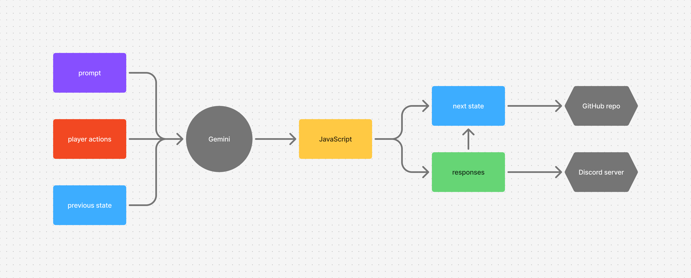
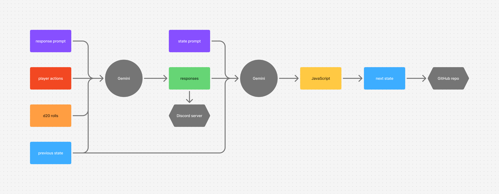
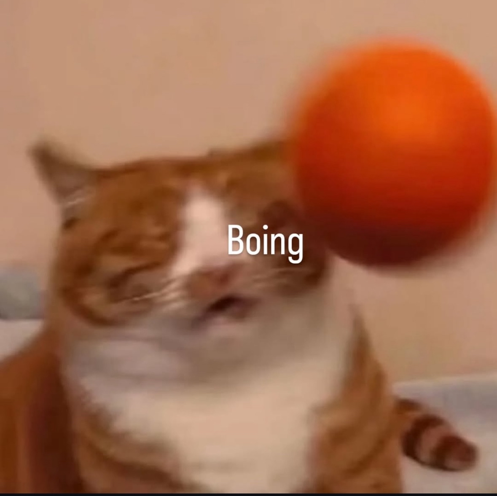

# :sparkle: $\subseteq$ Commit Challenge 2025
Welcome to the annual $\subseteq$ Commit Challenge 2025! The goal is to make contributions and a commit every day to build something that can (hopefully) be considered meaningful and deployable by the end of the year 🚀 fish are tasty

> [!CAUTION]
> Our pages site is available on [Github Pages](https://subset-ucsd.github.io/Commit-Challenge-2025/)

Our current participants:
- [ Nolan](https://github.com/NolanChai)
- [ Sean](https://github.com/SheepTester)
- [ Sean](https://github.com/Sean1572)
- [ Marcelo](https://github.com/dowhep)
- [ Nick](https://github.com/nick-ls)
- [ Raymond](https://github.com/raymosun)
- [ Khushi](https://github.com/khushijpatel)
- [ sam](https://github.com/sprestrelski)

> [!IMPORTANT]
> [CHAT B#C# DONE IT AGAIN](https://distrokid.com/hyperfollow/bc33/new-record-5)

# ✋ Want to Join?
Fill out this form [here](https://docs.google.com/forms/d/e/1FAIpQLSeI2mfek8_JKCqeqOqzPOCG9EXQH7tBUqhkY5F3WhRp3QKokA/viewform?usp=header)

> [!TIP]
> To join the cave game instance, contact someone through Discord.

```shell
$ ssh -i cavegameDONOTDELETE 159.223.201.89
```

where `cavegameDONOTDELETE` is the private key
 
## 🌟 Ye Olde Ode to Sam Altman


LOL thrice yonder! Let the digital scroll proclaim the marvels of Sam Altman, bard of venture, shepherd of start-ups, and wizard of wit. His leadership leaps beyond the moon, his curiosity climbs the heights of Everest, and his generosity flows as a river in spring. He fosters invention, kindles collaboration, and guides dreamers 'cross the stormy seas of code. With keen foresight, he carves pathways to tomorrow. O unstoppable champion! Our hearts bounce with giddy glee to follow thy sparkling example.


# :exclamation: Rules
You must commit to main. No malicious code pls.

# 🚧 Projects

> [!WARNING]
> Some projects may be functional.

in order of GDP:

Project | Description | Technologies | Files
--- | --- | --- | ---
[🏠 home page](https://subset-ucsd.github.io/Commit-Challenge-2025/) | | html css javascript web audio | `index.html` `ass/ets/` `m/a/r/c/el/o/` `.github/workflows/fuck.yml`
[🗡️ murder game](https://subset-ucsd.github.io/Commit-Challenge-2025/murder-game/public/) | for nick's acm cyber game hacking event | typescript canvas |  `murder-game/`
[📱 qr game](https://subset-ucsd.github.io/Commit-Challenge-2025/qrbox/) | jackbox but using qr codes | javascript | `qrbox/`
[🏃 escape game](https://subset-ucsd.github.io/Commit-Challenge-2025/escape/) | text based choose your own adventure | css typescript | `escape/` `.github/workflows/fuck.yml` `.github/workflows/compile.yml`
🐎 [horse](https://subset-ucsd.github.io/Commit-Challenge-2025/horse/) [but](https://subset-ucsd.github.io/Commit-Challenge-2025/horse-but-better/) [even better](https://subset-ucsd.github.io/Commit-Challenge-2025/horse-but-even-better/) | simulating wynncraft horse gambling | javascript | `horse/` `horse-but-better/` `horse-but-even-better/` `last-horse/`
[🔑 login](https://subset-ucsd.github.io/Commit-Challenge-2025/login) | ucsd phishing exercise | ctrl+C ctrl+V | `login.html`
[🕋 cube-spin](https://subset-ucsd.github.io/Commit-Challenge-2025/cube-spin/) | learning webgl | webgl | `cube-spin/`
[🪨 cave game](https://159.223.201.89:8080/) | 3d multiplayer roguelike game in a cave | typescript webgl cannon-es | `cave-game/` `.github/workflows/autolint.yml` `.github/workflows/fuckelonmusk.yml` `.github/workflows/compile.yml`
[📊 green](https://subset-ucsd.github.io/Commit-Challenge-2025/stats.html) | commit challenge stats | `remind/green.mts`
🚨 remind | sends discord reminders to commit daily | javascript rust serenity | `remind/`
📰 release | makes a nightly release for the repo each night summarizing changes using gemini | github actions gemini | `.github/workflows/release.yml` `gpt_prompt.txt`
🍺 drunk | | html | `help.html` `sean-retreat-attempt.html`
💭 gpt | | text | `gpt.txt`
📅 actions game | rpg game where you write your actions for the day in a text file and a github action runs daily and uses gemini to determine what happens next | github actions gemini typescript | `.github/workflows/release.yml` `actions/` `actions.md` `.github/workflows/actions_game_test.yml`
🤖 eat shit game | discord bot llm rpg game game | typescript discord.js | `🍴💩/`
[💥 explodes](https://subset-ucsd.github.io/Commit-Challenge-2025/explodes/) | phone at risk of fire | html css javascript | `explodes/`
godot web export test | | godot | `godot-web-export-test/`
❌ purr | enforces "you must commit to main." if you open a PR it will close it and delete the branch | github actions | `.github/workflows/purr.yml`
[🍉 fruit merge](https://subset-ucsd.github.io/Commit-Challenge-2025/fruit-merge/) | | html | `fruit-merge/`
[👑 queens](https://subset-ucsd.github.io/Commit-Challenge-2025/👑/) | [queens](https://www.linkedin.com/games/queens/) puzzle designer. can a queens puzzle with equally sized regions exist? | react | `👑/`

## Actions Lore

<figure>
   Gemini -> JavaScript (-> next state -> GitHub repo), (-> responses (-> next state), (-> Discord server))" />
  <figcaption>

**Figure 2.** Architecture diagram or flow or something of how the actions game was initially set up
  
  </figcaption>
</figure>

Initially, the actions game was implemented as shown in (Figure 2):

1. We had three files in the repo:

   - `prompt.md`: the prompt defining instructions and a JavaScript API (defined with TypeScript declarations) to manage the state

   - `state.yml`: contains the game state as mostly unstructured data:

      - `players`: a map of player name to a player object. The prompt used to recommend using methods like `setInfo` to edit the object, but I felt that this could discourage it from making more complicated structures. For example, to edit an object in `info`, it had to repeat the entire existing object in code. I then changed it to recommend mutating `health` and `info` directly.

        - `health`: originally managed with `changeHealth`
        - `inventory`: map of item name to count. managed with `addItem`, `removeItem`, so once an item goes to 0, it gets deleted. had a bug where Gemini inadvertently passed `undefined` as the count, setting the count to `NaN`
        - `info`: unstructured data, originally managed with `setInfo`

      - `worldInfo`: unstructured data, originally managed with `setWorldInfo`

      - `previousResponses`: stored the responses generated in the previous day

        This means that the game only has a reliable context window of only one day, after which we rely on Gemimi storing data in the state properties.

   - `actions.md`: the player input

1. The above three files were given as the prompt to Gemini and used to generate JavaScript code.

   While Gemini offers a way to separate the system prompt from user prompt, part of the enjoyment of an LLM-based game is to try to gaslight the bot, so we decided to combine both the game prompt and user actions into one prompt.

1. Process the JavaScript file a bit.

   Gemini likes to wrap code in backticks. I think, again, Gemini offers better ways to return code, but using a regular expression to comment those backticks out have been reliable enough.

   After removing the player/world info setter methods, it turned out that Gemini would sometimes get property accesses wrong, so a long property access like `player.Sam.info.cats.count` might be missing a key, resulting in a runtime error that crashes the game. I have another regular expression that wraps these property accesses with code that creates the necessary objects before making the property access.

1. Evaluate the JavaScript.

   ```js
   eval(js)
   ```

   This would probably be a bad idea in general, but all players of this game already have write access to the repo, so this doesn't let them do more damage than they already can.

1. Collect the responses.

   Part of the API we define for Gemini included `.respond()` for players and `describeDay()` for the world and instructions requiring these be called at least once. Multiple calls result in multiple paragraphs. One curiosity is that sometimes Gemini thinks it's also a getter when called with no arguments, so it once tried to use it to concatenate to a previous response.

1. Send the responses to three places:

   - A Discord webhook to display the results in our Discord server. However, due to Discord's character limit, oftentimes responses had to be truncated, which made it annoying to read.
   - The state's `previousResponses`.
   - Standard output, which was used as the commit message by the GitHub Actions workflow.

1. Save the new state into `state.yml` and commit and push the changes to the repo for the next day.

We also had a few unwritten rules:

- Don't directly edit others' actions (but you can use your prompt to gaslight the game and change others' actions).
- You can move your action in the file (i.e. change the order of players in `actions.md`).
- Looking at the state file is fair game because it defines the memory of the game. If it's not in the state file, it's not canon.
- Don't edit the game prompt for your own benefit.

There were a few issues with this setup, though:

- Gemini would say things but not save them in the state, meaning that it'll forget about it as soon as a day later.
- The game wasn't providing much gameplay on its own, so we eventually got bored of the game and weren't sure what to do next. We had to beg it to generate quests for us.
- It was too easy to gaslight the game. This was fun at first, but it eventually got boring.

<figure>
   Gemini -> responses (-> Discord server), state prompt, previous state -> Gemini -> JavaScript -> next state -> GitHub repo" />
  <figcaption>

**Figure 4.** Architecture diagram of actions game v2

  </figcaption>
</figure>

To fix the game state issue, we tried splitting the Gemini calls in two:

1. **Response**: The first call generates the responses for players (so `.respond()` and `describeDay()` were removed) as prose in Markdown, based on the previous state and player actions.

   Generating it in plain text rather than separate `respond()` calls seemed to have encouraged it to write more, and the responses per player seemed more coherent in general.

2. **State**: The second call edits the state object based on the generated responses. It has access to the previous game and responses, but not the player actions, hopefully making it harder to change the game state by gaslighting the bot.

   To reduce the context size and to encourage relying more on the state object, I also removed `previousResponses` from the state object, so the first call doesn't have access to its previous output.

To prevent players from pretending to be system administrators, we asked Gemini to ignore them. Hopefully that works!

We also introduced a d20 roll system. Before the first Gemini call, we generate a random number from 1 to 20 in JavaScript (i.e., an LLM does not generate them) for each player. We include these numbers in the prompt for the first call, and ask Gemini to use these to determine the success of each player's action. This should hopefully limit the effectiveness of players jailbreaking the prompt.

# :memo: Current To-Dos

> [!CAUTION]
> Feel free to leave ideas here

- [X] Github Pages

- [ ] choose your own adventure game

- [ ] qr-code based offline jackbox

- [ ] Cave game
  - [ ] Get server running 
  - [ ] Get networking going
  - [ ] Get renderer working

- [ ] Movies
  - [x] Epic
  - [x] Wild Robot
  - [X] Flow
  - [ ] Monty Python and the Holy Grail
  - [ ] Princess Bride
  - [ ] Anora
  - [ ] fruity pinocchio
  - [ ] how to train ur dragon series

# Roadmap





# I don't like the news counter 

|
