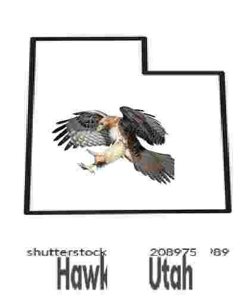

# [CHAT B#C# DONE IT AGAIN](https://distrokid.com/hyperfollow/bc33/new-record-4)

# :sparkle: $\subseteq$ Commit Challenge 2025
Welcome to the annual $\subseteq$ Commit Challenge 2025! The goal is to make contributions and a commit every day to build something that can (hopefully) be considered meaningful and deployable by the end of the year 🚀 fish are tasty

> [!CAUTION]
> Our pages site is available on [Github Pages](https://subset-ucsd.github.io/Commit-Challenge-2025/)

Our current participants:
- [ Nolan](https://github.com/NolanChai)
- [ Sean](https://github.com/SheepTester)
- [ Sean](https://github.com/Sean1572)
- [ Marcelo](https://github.com/dowhep)
- [ Nick](https://github.com/nick-ls)
- [ Raymond](https://github.com/raymosun)
- [ Khushi](https://github.com/khushijpatel)
- [ 3dcantaloupe](https://github.com/3dcantaloupe)
- [ sam](https://github.com/sprestrelski)

# ✋ Want to Join?
Fill out this form [here](https://docs.google.com/forms/d/e/1FAIpQLSeI2mfek8_JKCqeqOqzPOCG9EXQH7tBUqhkY5F3WhRp3QKokA/viewform?usp=header)

# :exclamation: Rules
You must commit to main. No malicious code pls.

# :memo: Current To-Dos

> [!WARNING]
> Feel free to leave ideas here

- [X] Github Pages
  - [X] Bro the current github page hurts my eyes someone pls fix Marcelo's eyes

- [ ] choose your own adventure game

- [ ] qr-code based offline jackbox

- [ ] Cave game
  - [ ] Get server running 
    - I just applied for a cheap server will hear back in like 6 days. 
      - can we get an update here
  - [ ] Get networking going
  - [ ] Get renderer working

# Roadmap

