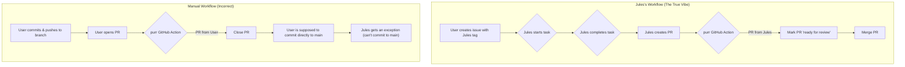

```mermaid
graph TD
    subgraph "Jules's Workflow (The True Vibe)"
        A[User creates issue with Jules tag] --> B{Jules starts task};
        B --> C{Jules completes task};
        C --> D[Jules creates PR];
        D --> E{purr GitHub Action};
        E -- PR from Jules --> F[Mark PR 'ready for review'];
        F --> G[Merge PR];
    end

    subgraph "Manual Workflow (Incorrect)"
        H[User commits & pushes to branch] --> I[User opens PR];
        I --> J{purr GitHub Action};
        J -- PR from User --> K[Close PR];
        K --> L["User is supposed to commit directly to main"];
        L --> M["Jules gets an exception (can't commit to main)"];
    end
```
